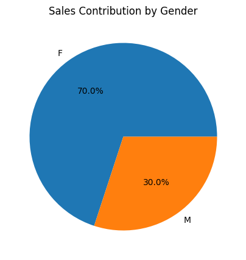
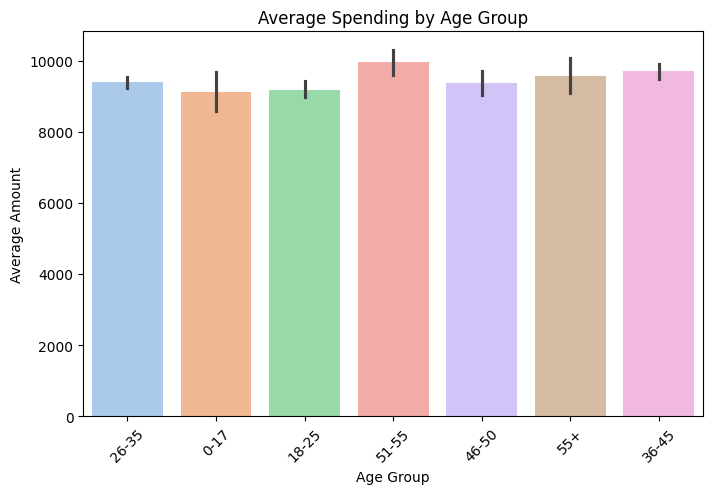
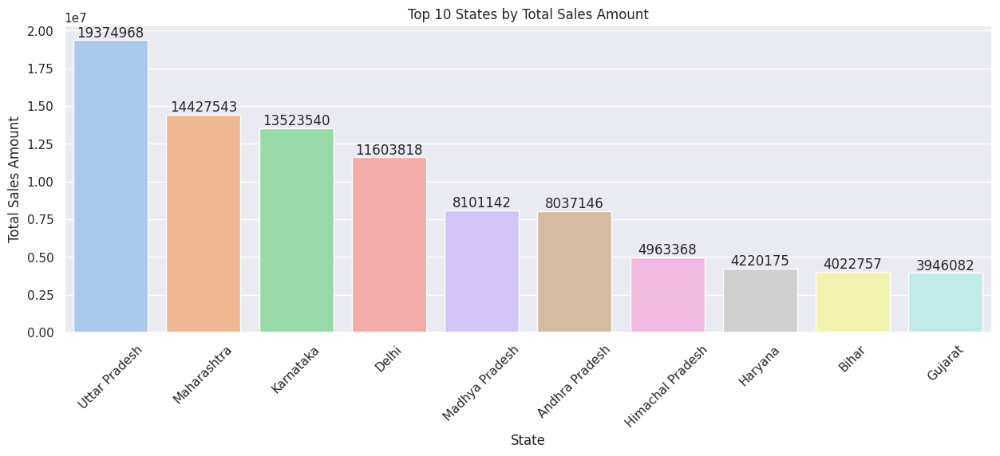
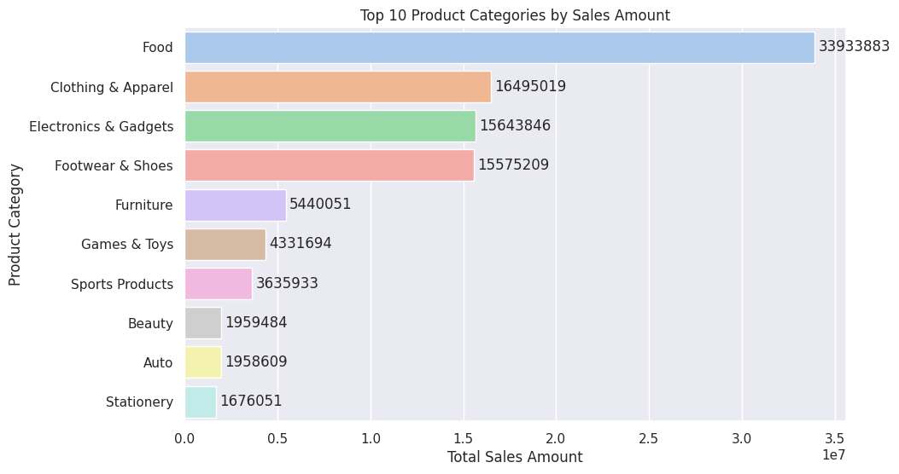
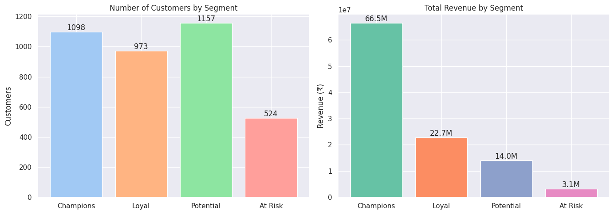
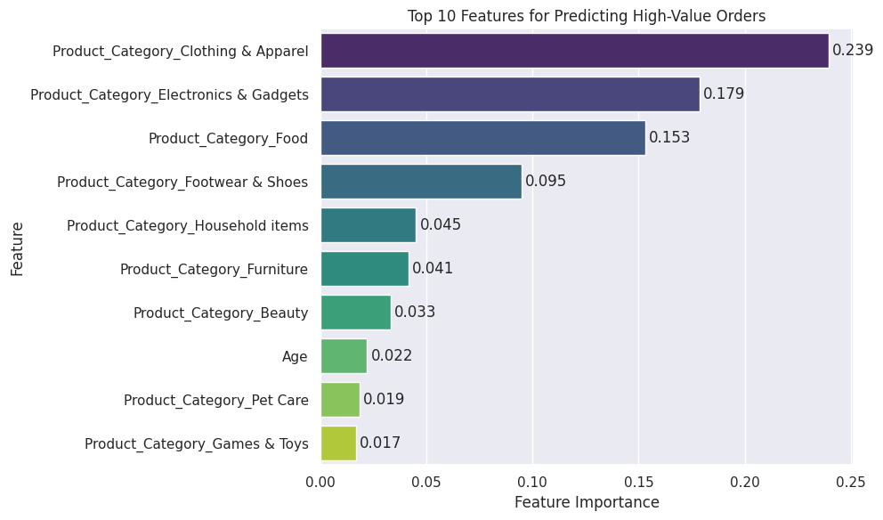

# Sales Analysis (Python)

Exploratory and predictive analysis of a retail sales dataset using Python (pandas, matplotlib, seaborn, scikit-learn). The goal is to profile the highest-value customer segments and turn descriptive findings into actionable, decision-ready insights for seasonal marketing and inventory planning.

## ✨ Project Highlights

- Cleaned and analyzed **11,251 transactions** from **3,752 customers** across **16 states** and **18 product categories**.
- Built a complete pipeline in Python: **cleaning → KPIs → EDA → advanced analytics → recommendations**.
- Went beyond standard EDA with **customer segmentation**, **market-basket analysis**, and a **machine-learning model**.
- Trained a Random Forest that predicts high-value orders at **ROC-AUC ≈ 0.88**.
- Found a clear Pareto pattern: **~29% of customers generate ~62% of revenue**.
- Produced a fully reproducible notebook and a rendered **PDF report** with 29 charts.

## 🖼️ Preview

A selection of charts from the analysis (full set in the [notebook](notebooks/sales_analysis.ipynb) and [PDF report](reports/sales_analysis.pdf)):

| | |
|:---:|:---:|
| **Revenue by Gender** | **Spending by Age Group** |
|  |  |
| **Top States by Sales** | **Top Product Categories** |
|  |  |
| **Customer Segments (Frequency–Monetary)** | **Model — Top Predictive Features** |
|  |  |

## ❓ Business Questions

The analysis was framed around five questions a sales/marketing team would actually ask:

1. **Who is the most valuable customer?** Which gender, age group, and marital status contribute the most revenue?
2. **Where is the revenue concentrated?** Which states and occupations drive the highest sales?
3. **What sells most?** Which product categories lead in orders and revenue?
4. **Which customers should we prioritize?** Can we segment customers by value to focus retention and up-sell spend?
5. **Can we predict a high-value order in advance?** What attributes signal an order in the top 25% by value?

## 📈 Key Performance Indicators (KPIs)

| Metric | Value |
|---|---|
| Total Revenue | **₹10.62 crore** (₹106,249,129) |
| Total Orders | **27,981** |
| Unique Customers | **3,752** |
| Unique Products | **2,350** |
| Average Order Value (AOV) | **≈ ₹3,797** |
| Average Spend per Customer | **≈ ₹28,318** |
| Top Product Category | **Food** |
| Top State by Revenue | **Uttar Pradesh** |

## 📂 Repository Structure

```
Sales-Analysis-Python/
├── data/
│   └── sales_analysis_data.csv     # Raw dataset (11,251 records)
├── notebooks/
│   └── sales_analysis.ipynb        # Full analysis (run end-to-end)
├── reports/
│   └── sales_analysis.pdf          # Rendered report with all charts
├── images/                         # Key plots used in the README preview
├── requirements.txt
├── LICENSE
└── README.md
```

## 📊 Dataset

| | |
|---|---|
| Records | 11,251 raw → 11,239 after cleaning |
| Columns | 15 (demographics, geography, occupation, product category, orders, amount) |
| Customers / Products | 3,752 / 2,350 |
| Coverage | 16 states, 18 product categories |

Two empty columns (`Status`, `unnamed1`) and 12 rows with missing `Amount` were removed during cleaning.

## 🔑 Key Findings

- **Female customers drive 70% of revenue** — more than 2× male spend.
- **The 26–35 age group generates 40%** of all sales; the 26–45 band covers ~61%.
- **Top 5 states** (UP, Maharashtra, Karnataka, Delhi, Andhra Pradesh) account for ~63% of revenue.
- **IT, Healthcare and Aviation** lead by occupation; **Food, Clothing and Electronics** lead by category.
- `Amount` shows near-zero correlation with `Age` and `Orders` — purchase value is segment-driven, not driven by basket size or age.

**Ideal customer:** a married woman aged 26–35, in UP / Maharashtra / Karnataka, working in IT, Healthcare or Aviation, buying Food, Clothing and Electronics.

## 🚀 Advanced Analysis (beyond standard EDA)

- **Customer Segmentation (Frequency–Monetary):** ~29% of customers (*Champions*) drive ~62% of revenue. *(Recency is omitted — the dataset has no date field, so a full RFM isn't possible.)*
- **Market-Basket Analysis:** Clothing+Food, Clothing+Electronics and Electronics+Food are the strongest co-purchased category pairs — clear bundle/cross-sell candidates.
- **Predictive Model:** A Random Forest predicts high-value (top-25%) orders at **ROC-AUC ≈ 0.88**. Product category is the dominant predictor; demographics add little — i.e. *what* is bought matters more than *who* buys.

## 🧭 Workflow

1. Load and inspect the data
2. Clean — drop blank columns, drop nulls, fix dtypes
3. Compute KPIs and contribution percentages
4. Exploratory analysis across Gender, Age, State, Marital Status, Occupation, Product Category
5. **Advanced analysis** — FM customer segmentation, market-basket co-purchase, high-value-order prediction
6. Conclusion, business recommendation, and next steps

## ⚙️ How to Run

```bash
git clone https://github.com/<your-username>/Sales-Analysis-Python.git
cd Sales-Analysis-Python
pip install -r requirements.txt
cd notebooks
jupyter notebook sales_analysis.ipynb
```

The notebook reads the dataset from `../data/sales_analysis_data.csv`, so run it from the `notebooks/` folder (or open the repo root in Jupyter).

## 🛠️ Tech Stack

Python · pandas · NumPy · matplotlib · seaborn · scikit-learn · Jupyter

## 📄 Attribution

The dataset and the baseline project structure are adapted from a publicly available sales-analysis tutorial by Rishabh Mishra. This version extends the original with a consolidated KPI summary, contribution-percentage analysis, refined and labelled visualizations, a Frequency–Monetary customer segmentation, a market-basket analysis, a high-value-order prediction model, and an expanded data-grounded conclusion.

## 📝 License

Released under the MIT License — see [LICENSE](LICENSE).
